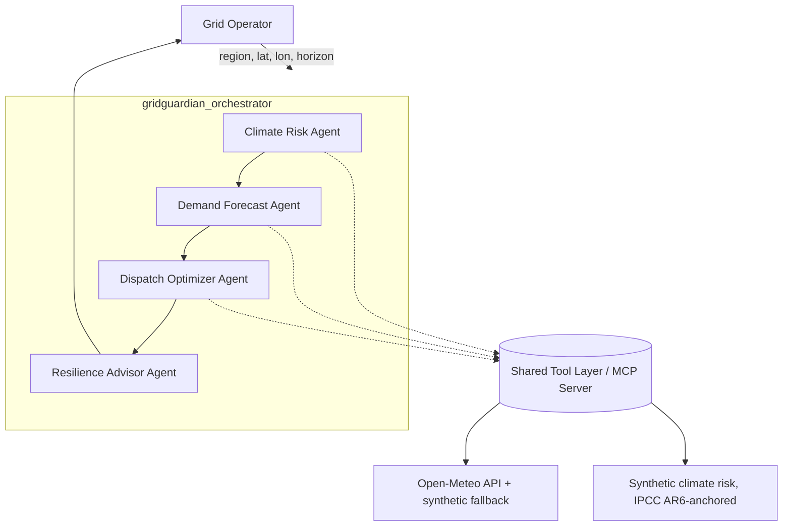

GridGuardian AI
Climate-aware dispatch advice for solar + battery microgrids, in one call
Track: Agents for Good

The problem
Distributed energy resources — rooftop and community solar paired with
battery storage — are spreading fast, and SDG 7 (Affordable and Clean
Energy) depends on them being dispatched well: charge the battery when
power is cheap and clean, discharge it when it's expensive or dirty, and
don't waste solar generation by curtailing it unnecessarily.
But "dispatch well" usually means "dispatch well for today's weather and
today's prices." It rarely accounts for a slower-moving signal that
matters just as much under SDG 13 (Climate Action): regional climate risk.
A coastal substation facing an elevated storm-surge or flood probability
this week should not be drained down to 10% state-of-charge chasing a
marginal arbitrage saving — it should keep enough reserve to island itself
if the grid connection drops. A region heading into a multi-day heatwave
should expect an afternoon demand spike that a purely price-driven
optimizer won't see coming until it's already happening.
Today, folding climate risk into dispatch decisions requires a human
analyst to separately check a weather forecast, separately think about
regional hazard exposure, and then manually adjust a battery's reserve
setting — a slow, easy-to-skip step, especially for smaller utilities and
microgrid operators who don't have a dedicated resilience team.
The solution
GridGuardian AI is a four-agent pipeline that produces one artifact: a
plain-language resilience briefing that tells an operator exactly what
their microgrid should do right now, with climate risk already folded
into the recommendation.
```
Climate Risk Agent -> Demand Forecast Agent -> Dispatch Optimizer Agent -> Resilience Advisor Agent
```
Climate Risk Agent looks up heatwave probability, flood risk,
storm-surge risk, and sea-level-rise trend for the operator's region,
and converts that into a single number: what fraction of battery
capacity should be held in reserve for resilience.
Demand Forecast Agent pulls an hourly weather forecast and runs it
through a bagged-regression-tree load model (the same modeling family
used in production smart-grid demand forecasting) to predict the next
24–48 hours of load, with an uncertainty band.
Dispatch Optimizer Agent reads the real-time battery/solar/load
telemetry and solves a linear program for the least-cost mix of grid
import, battery discharge/charge, and solar curtailation — honoring the
reserve floor the Climate Risk Agent set.
Resilience Advisor Agent has no tools at all. It only reads the
structured JSON the three agents above produced and turns it into a
short Markdown briefing a non-technical operator can act on in under a
minute. Because it has no tools, it cannot hallucinate a number that
isn't already in its input — every figure it cites is traceable to a
real upstream computation.
This is deliberately a pipeline of specialists rather than one large
agent with every tool bolted on. Climate hazard interpretation and convex
dispatch optimization are different disciplines with different failure
modes; keeping them in separate agents with separate, short instruction
prompts makes each one easier to test, debug, and improve independently —
and makes the system's reasoning auditable instead of being one long,
opaque chain of thought.
Why agents (not a script)?
A traditional script could call a weather API and a solver, but it
couldn't interpret a flood-risk index the way an LLM-backed agent can —
turning "storm_surge_risk_index: 0.44" into "hold back 18% of the
battery, here's why" requires judgment, not just arithmetic. The final
synthesis step is the clearest case: turning four structured JSON blobs
into a calibrated, prioritized, plain-English recommendation a tired
operator can trust at 2 a.m. is a language task, and that's exactly what
an LLM agent is good at — provided (as GridGuardian enforces) it isn't
allowed to invent its own numbers along the way.
Architecture

Full diagram and design rationale: `docs/ARCHITECTURE.md`.
Multi-agent system (ADK): four `LlmAgent`s composed with ADK's
`SequentialAgent`, each writing a typed JSON result into session state via
`output_key`, read by downstream agents through `{key}` instruction
templating.
MCP Server: every tool function (`get_weather_forecast`,
`get_climate_risk_assessment`, `get_grid_telemetry`, `get_demand_forecast`,
`get_dispatch_plan`) is implemented exactly once and exposed two ways —
directly to the ADK agents, and as a standalone FastMCP server any other
MCP client (Claude Desktop, Gemini CLI, another team's agent) can call
without depending on this repo's agent code at all.
Security features: every tool call passes through a rate limiter
(token bucket, per caller/tool), strict input validation (geographic
bounds, percentage bounds, allowlisted identifiers) before touching the
solver or an outbound HTTP call, secrets read only from environment
variables (never hardcoded), and audit logging that hashes arguments
before they're written to a log, so operational data never appears in
plaintext logs.
Deployability: a non-root Dockerfile, `docker-compose.yml` for local
multi-service runs, and two GitHub Actions workflows — CI (lint with
`ruff`, static security scan with `bandit`, full pytest suite on Python
3.11/3.12) and a Docker build-and-publish workflow with a reference Cloud
Run deploy job.
Agent skills (CLI): a single installable `gridguardian` command
(`pip install -e .`) gives operators and CI pipelines direct access to
every capability — `gridguardian telemetry`, `forecast`, `dispatch`,
`climate-risk`, `briefing`, and `serve-mcp` — with no ADK or MCP knowledge
required to use it.
Implementation notes
The data layer follows a tiered-fallback pattern: weather comes from the
free, key-less Open-Meteo API, falling back to a seeded synthetic model if
the network is unreachable, so the system is always demoable offline.
Climate-risk indicators (storm surge, flood, sea-level-rise trend) use a
synthetic model anchored to published IPCC AR6 global sea-level-rise
ranges, since no free, key-less, real-time API exists for regional
hazard indices at this scope — the function's return type is the
production-shaped contract, so swapping in a real NOAA/Copernicus dataset
later is a one-function change.
The demand forecaster is a `RandomForestRegressor` (bagged regression
trees) trained lazily on synthetic-but-physically-structured historical
data (diurnal + weekly seasonality, temperature-driven cooling load) on
first use, with per-tree variance used as a cheap prediction-interval
proxy. The dispatch optimizer is a five-line linear program solved with
`scipy.optimize.linprog`'s HiGHS backend, with an explicit degraded-plan
fallback if the LP is infeasible (e.g., demand exceeds all available
supply), so the system always returns an actionable plan rather than
crashing on an extreme scenario.
Testing & quality
37 pytest tests cover input validation, rate limiting, the data/tool
layer, the optimization LP (including the infeasible-degrade path and the
reserve-floor behavior), the forecasting model, and the agent wiring
itself (correct sub-agent order, correct tools attached to each agent,
correct `{state}` references between agents) — all without requiring an
LLM API key, so CI runs fully offline. `ruff` and `bandit` both run clean
in CI.
Project journey
This project grew out of two earlier MATLAB-based projects: an
Intelligent Energy Management System for smart grids (bagged-tree demand
forecasting + `linprog`-style dispatch optimization) and a coastline
climate-risk model built on IPCC AR6 sea-level-rise scenarios. GridGuardian
re-implements both ideas in Python on top of Google ADK, and adds the
piece neither original project had: an agent layer that actually connects
climate risk to the dispatch decision, instead of treating them as two
unrelated analyses an operator has to combine by hand. The biggest design
decision was making the final Resilience Advisor Agent tool-less by
design — once that constraint was in place, every other architectural
choice (typed `output_key` state, short single-purpose prompts) followed
from wanting that synthesis step to be trustworthy rather than merely
fluent.
What's next
Replace the synthetic climate-risk model with a real NOAA/Copernicus
regional feed.
Add a `ParallelAgent` variant so Climate Risk and Demand Forecast run
concurrently (they're currently independent and only the Dispatch
Optimizer depends on both).
Wire the MCP server's `TokenVerifier` for real auth before exposing it
beyond a trusted network.
Multi-substation batch mode, so a utility can get briefings for an
entire feeder in one call.
